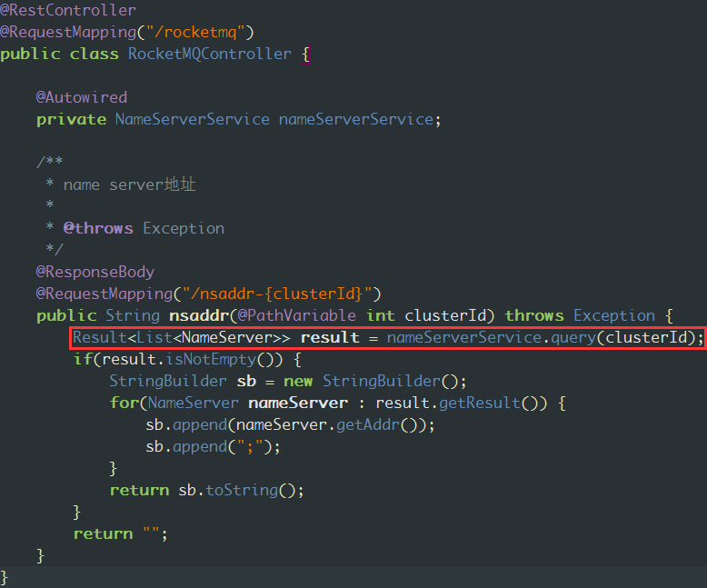

## <span id="ns">一、Name Server</span>

先看一张RocketMQ的部署图：


Name Server的重要性：

1. 生产者或消费者从NameServer获取topic路由信息，继而可以跟broker交互。
2. broker定时向NameServer注册，包含broker地址和topic信息。

了解NameServer请[参考](https://blog.csdn.net/a417930422/article/details/52585414)。这里不再过多介绍NameServer。

## <span id="addressing">二、Name Server寻址方式

先看一下官方的文档介绍：

```
RocketMQ有多种配置方式可以令客户端找到Name Server, 然后通过Name Server再找到Broker，分别如下：
优先级由高到低，高优先级会覆盖低优先级。

一、 代码中指定 Name Server地址
producer.setNamesrvAddr("192.168.0.1:9876;192.168.0.2:9876");
或
consumer.setNamesrvAddr("192.168.0.1:9876;192.168.0.2:9876");

二、 Java 启动参数中指定Name Server地址
-Drocketmq.namesrv.addr=192.168.0.1:9876;192.168.0.2:9876

三、 环境变量量指定 Name Server地址
export NAMESRV_ADDR=192.168.0.1:9876;192.168.0.2:9876

四、 HTTP 静态服务器寻址
客户端启动后，会定时访问一个静态 HTTP 服务器，地址如下：
http://jmenv.tbsite.net:8080/rocketmq/nsaddr
返个URL的返回内容如下：
192.168.0.1:9876;192.168.0.2:9876
客户端默认每隔2分钟访问一次返个 HTTP 服务器，并更新本地的 Name Server 地址。
URL已经在代码中写死，可通过修改/etc/hosts文件来配置为要访问的服务器。
推荐使用 HTTP 静态服务器寻址方式，好处是客户端部署简单，且 Name Server 集群可以热升级。
```

*由于Name Server集群中每个节点之间是不进行通信的，也就是Name  Server集群每个节点是孤立的，所以客户端必须知道Name Server集群中所有的节点。采用http域名方式可以动态修改节点个数，从而实现动态扩容，缩容，上下线等运维操作。*

MQCloud采用了官方推荐的方式：使用域名的方式的寻址，方便生产环境节点迁移等运维。具体来说，其实包括两部分：

1. 客户端的寻址，包括生产者和消费者如何发现Name Server集群。
2. broker端的寻址，broker需要向Name Server集群定时注册。

但是这两部分的寻址代码都是一样的，下面会进行说明。

## <span id="http">三、Name Server Http服务器-MQCloud</span>

MQCloud使用自身作为发现Name Server的http服务器。如果按照[wiki](https://github.com/sohutv/mqcloud/wiki)部署过MQCloud，那么访问如下类似url：

```
http://127.0.0.1:8080/rocketmq/nsaddr-1
```

就会发现其返回了Name Server集群的列表：

```
127.0.0.1:9876;127.0.0.2:9876;
```

URL解释：

1. `http://127.0.0.1:8080`MQCloud域名，具体线上使用时建议采用域名
2. `/rocketmq/nsaddr-{unitName}`RocketMQ按照http寻址拼装的路径，下面有详细解释。

MQCloud是支持多集群Name Server发现的，其实就是借用了RocketMQ的http寻址方式中的unitName。

说到这里，不得不说RocketMQ根据http寻址的代码(这里将代码进行简化，只列出关键代码)：

```
// 第一步.获取系统配置域名的变量
String wsDomainName = System.getProperty("rocketmq.namesrv.domain", DEFAULT_NAMESRV_ADDR_LOOKUP);
// 第二步.获取域名后的子路径
String wsDomainSubgroup = System.getProperty("rocketmq.namesrv.domain.subgroup", "nsaddr");
String url = "http://" + wsDomainName + ":8080/rocketmq/" + wsDomainSubgroup;
if (wsDomainName.indexOf(":") > 0) {
    // 第三步.如果域名包含冒号，则改变拼装路径
    url = "http://" + wsDomainName + "/rocketmq/" + wsDomainSubgroup;
}
// 第四步.如果设置了unitName，则改变拼装路径
if (!UtilAll.isBlank(this.unitName)) {
    url = wsAddr + "-" + this.unitName + "?nofix=1";
}
```

详细解释(以域名为127.0.0.1为例)：

1. 第一步中，MQCloud会设置环境变量setProperty("rocketmq.namesrv.domain", "127.0.0.1:80")。

2. 第三步中，由于wsDomainName携带了冒号，所有url会变成：`http://127.0.0.1:80/rocketmq/nsaddr`

3. 第四步中，MQCloud会进行类似设置：clientConfig.setUnitName("clusterId");，这样，RocketMQ的Name Server http url就会携带集群id，类似如下：

   ```
   http://127.0.0.1:8080/rocketmq/nsaddr-{clusterId}
   ```

   那么，MQCloud只要配置好对应路径的controller映射，即可根据集群id从数据库查询Name Server列表了，代码类似如下：

   

## <span id="client">四、针对客户端的配置</span>

这里的客户端是指生产者和消费者，MQCloud会自动进行如下设置，[使用参见](https://github.com/sohutv/mqcloud/wiki/4.%E5%AE%A2%E6%88%B7%E7%AB%AF%E7%9A%84%E4%BD%BF%E7%94%A8)：

```
// 设置Name Server域名
setProperty("rocketmq.namesrv.domain", "mqcloud域名:80");
// 设置单元名
clientConfig.setUnitName("集群id");
```

其中，`mqcloud域名`是需要写死的。而`集群id`是客户端启动时候自动从MQCloud上查询而来的，类似如下：

```
访问：http://mqcloud域名/cluster/info?topic=mail-test&group=mail-media-group-test&role=1
返回值：
{
  status: 200,
  message: "OK",
  result: {
    clusterId: 1, // 集群id
    vipChannelEnabled: true, // 开启虚拟通道
    broadcast: false, // 广播消费
    traceEnabled: false // 开启trace
  }
}
```

这里不过多介绍此机制，后续在客户端里进行详细介绍。

## <span id="broker">五、针对broker的配置</span>

broker的配置方式与客户端不同，但是和客户端使用的代码都是一样的，具体如下：

```
rmqAddressServerDomain=mqcloud域名:80
rmqAddressServerSubGroup=nsaddr-集群id
fetchNamesrvAddrByAddressServer=true
```

如果使用MQCloud部署，这些设置都会是自动的。由此可以看到http方式发现Name Server方式域名的重要性，所以[MQCloud使用](https://github.com/sohutv/mqcloud/wiki/3.%E5%88%9B%E5%BB%BA%E9%9B%86%E7%BE%A4)里，一开始就强调了这项配置：


而集群id，我们使用MQCloud一开始就需要创建集群记录：


这样就会在数据库的cluster表增加一条记录，然后使用`+NameServer`或者`关联NameServer`功能，就可以将NameServer列表和cluster建立关系，从而可以实现根据clusterId查找NameServer列表的功能。

## <span id="deploy">六、MQCloud高可用部署</span>

*如果没有使用MQCloud提供的客户端和部署RocketMQ，仅使用其监控，统计，预警功能，那么此步骤可以跳过。*

如果使用MQCloud部署了RocketMQ，那么MQCloud肩负了Name Server http方式寻址的重要责任，我们需要保证MQCloud的高可用，由于MQCloud其实仅仅是一个web应用，所以按照普通web应用高可用的方式部署即可，部署参照如下：

