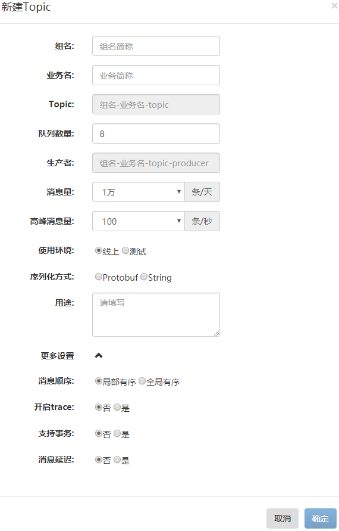
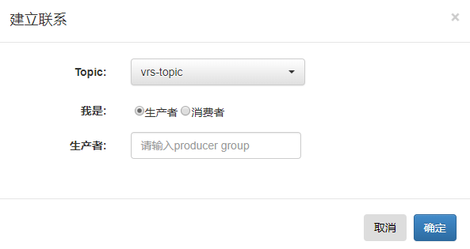
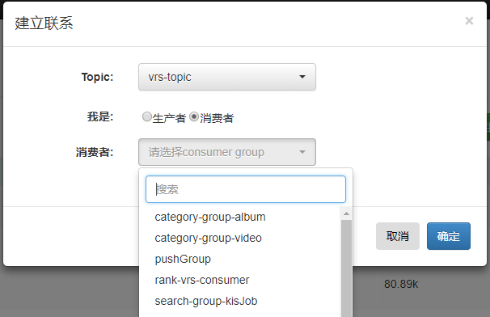
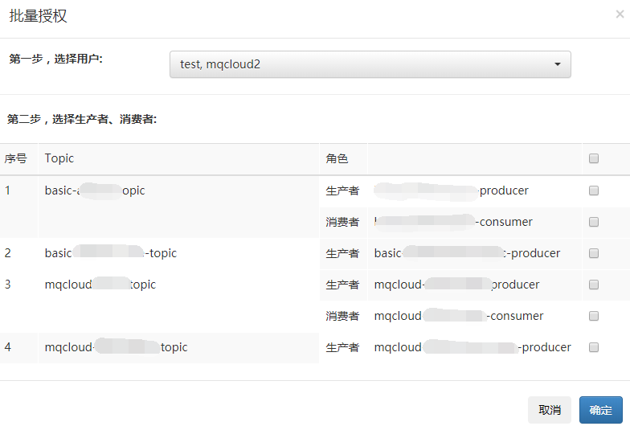

## 一、创建topic

点击[生产消息](/)，选项如下图：

各个选项释义如下：

**组名**：业务组的名字，比如用户组可以填user。

**业务名**：具体的业务名字，比如用户订单业务可以填order。

**Topic**：组名-业务名-topic。

*为了规范命名，MQCloud自动根据`组名`和`业务名`命名topic和producerGroup的名字。*

**队列数量**：默认为一个broker8个队列，如非特殊需求，不建议修改，后期可以动态扩容。

**生产者**：producerGroup的名字，组名-业务名-topic-producer。

**消息量**：请根据业务预估量填写，单位 `条/天`。

**高峰消息量**：请根据业务预估量填写，单位 `条/秒`。

**使用环境**：如果是测试使用，请选择测试环境，将会在测试集群创建此topic。

**序列化方式**：这里有两种方式：

1. Protobuf

   优点：大多数情况下压缩比高，性能好。

   缺点：兼容性差，消费方须用Protobuf反序列化。

   **如果此topic自己使用，建议选择此种方式序列化。**

2. String

   优点：可以使用json或xml，跨语言。

   缺点：性能和压缩比不高。

   **如果此topic别人消费，建议使用此种方式序列化。**

   *如果选择String方式，需要业务自己用JSON库或者XML库序列化数据，具体参考[发送json消息](clientProducer#produceJson)。*

**用途**：此topic在业务里的用途，该项同样会展示在topic的`用途`信息里。

**消息顺序**：默认为[局部有序](clientConsumer#normalOrder)，如果需要[全局有序](clientConsumer#strictOrder)，请更改此选项，全局有序将丧失高可用性。

**开启Trace**：默认不开启trace，如果开启trace后，使用MQCloud提供的客户端将自动对消息进行trace，并可以在`消息查询`模块查看trace情况。

**支持事务**：默认不支持事务，如果勾选支持事务，将会在事务集群创建此topic。

**消息延迟**：该选项的意义是告知MQCloud从哪里获取统计数据，由于RocketMQ的延迟消息与普通消息统计方式不同，MQCloud需要知道此topic是否用于发送延迟消息。

## 二、消费消息

点击[消费消息](/)，选项如下图：

各个选项释义如下：

**Topic**：选择想要消费的topic。

**消费者**：就是consumerGroup，这里建议采用：组名-业务名-部分topic名-consumer 的命名方式。

**消费方式**：

1. 集群消费：所有的消费者均分消息进行消费。
2. 广播消息：每个消费者会消费所有的消息。

**用途**：根据业务填写。

## 三、关联资源

MQCloud可以管理已有的集群，但MQCloud并不知道以前的集群中已经存在的topic归属于谁，所以用户需要通过**关联资源**入口， 与生产者或消费者进行关联，这样才能让MQCloud为您服务。

#### 1 关联生产者

各个选项释义如下：

**Topic**：选择想要关联的topic。

**我是**：选择**生产者**。

**生产者**：输入**producerGroup**即可，一般查看之前的代码配置就知道了。

#### 2 关联消费者

各个选项释义如下：

**Topic**：选择想要关联的topic。

**我是**：选择**消费者**。

**消费者**：选择即可，如果consumer group列表没有，请联系管理员添加。

## 四、批量授权

在[topic详情页](topic#detail)可以授权生产者权限给单个用户，在[消费详情](topic#consume)页可以授权消费者权限给单个用户，但是，某些情况下，有希望将自己拥有的生产者和消费者批量授权的需求，故有了此功能，如下：

## 五、搜索ip

可以使用此功能搜索某日内的ip连接的生产者或消费者：

